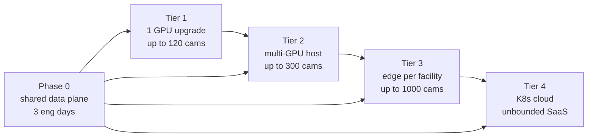
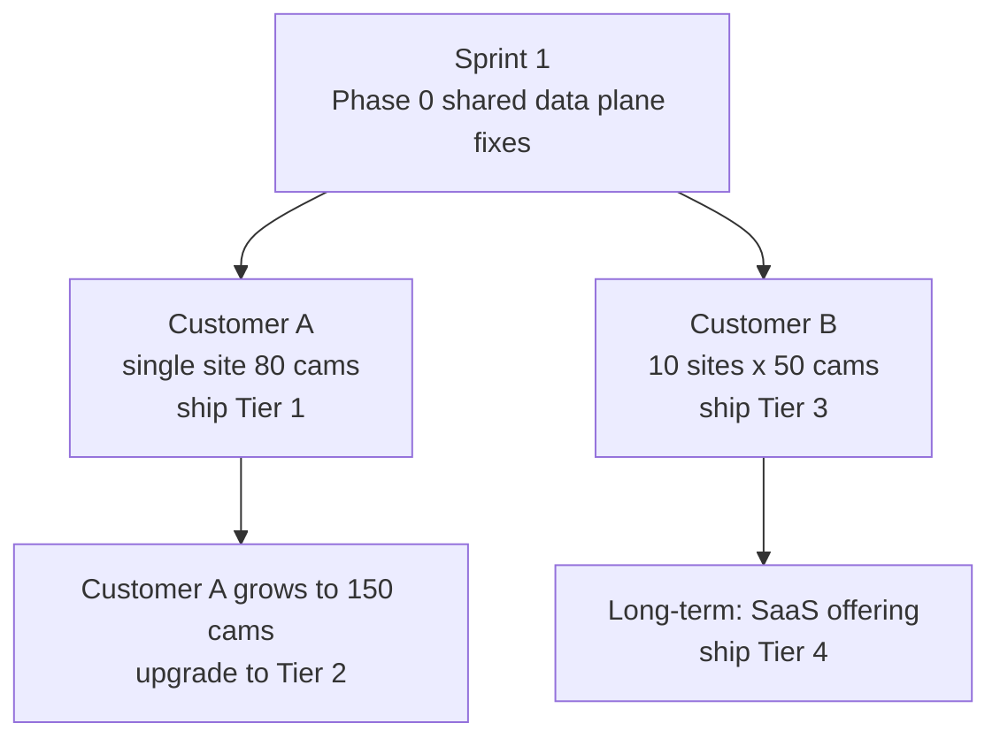

# NAVA Compliance Monitor — Scaling Proposal: Beyond 50 Cameras

| | |
|---|---|
| **Document** | Scaling Proposal — Camera Count > 50 |
| **Version** | 1.0 |
| **Status** | Draft — pending stakeholder approval |
| **Owner** | Engineering (Mahesh / Amar) |
| **Audience** | Leadership, Sales, Operations, Customer Success |
| **Date** | 2026-05-25 |

---

## 1. Executive Summary

The current NAVA platform is engineered for `~50 cameras per facility` on a single GPU node. Several customer scenarios (large plants, multi-site rollouts, enterprise contracts) require us to grow past this limit. This document presents **four cost-tiered scaling options** so leadership can pick the right one per deployment scenario, plus a **shared baseline upgrade** that benefits every option.

**Key takeaways for approvers:**

- We do **not** need a single big architectural rewrite. The system was designed with Kafka and stateless workers from day one, so scaling is incremental.
- **Tier 1** (swap to a bigger GPU, ~USD 2–3K capex) takes us from 50 → ~120 cameras with **zero** architectural change. This is the recommended first step for most customers.
- **Tier 3** (one edge box per facility) gives the **lowest cost-per-camera at multi-site scale** and is the standard NVIDIA reference design.
- **Tier 4** (Kubernetes cloud) is only justified for SaaS or 500+ camera enterprise deployments.
- A small **shared data-plane upgrade** (~3 engineering days) unblocks every tier and should be done first regardless of which tier we sell.

**The decision we need from stakeholders:**

1. Approval to ship the shared data-plane upgrade in the next sprint.
2. Approval of the per-tier price points and a default offering for the sales team.
3. Budget sign-off for a reference Tier 2 / Tier 3 deployment we can demo.

---

## 2. Current State (as of May 2026)

| Layer | Today | Limit |
|---|---|---|
| **AI inference** | DeepStream 9.0 + YOLOX-S + TRT 10.14 FP16 on **one RTX 5050** | TRT engine compiled at `batch-size=16`; `DS_MAX_SOURCES=16` |
| **Camera ingest** | `nvmultiurisrcbin` (dynamic RTSP) | 1 NIC, 50 cams × 4 Mbps ≈ 200 Mbps inbound |
| **Event bus** | Kafka KRaft single-broker | Topics: `nava.cameras` (compact), `nava.events.raw`, `nava.heartbeats`, `nava.alerts.outbound` |
| **Backend** | 1 × FastAPI replica, single `event_consumer` task | Will saturate on event burst |
| **Database** | 1 × MongoDB 7 | No replica set, no TTL, single disk |
| **Evidence** | Local bind mount (`/data/evidence`) | Disk fills, no retention policy |
| **Dashboard live feed** | 1 × SSE relay (`GET /api/sse/events`) | Single-replica fan-out only |
| **Alert dispatch** | 1 × `alert_consumer` (Syncro SMS / WhatsApp / OBD) | Already async via Kafka — good |

**Reference code:** `pipeline/deepstream/config_infer_primary_yolox.txt`, `docker-compose.yml`, `backend/app/messaging/*`, `pipeline/README.md` §"Scaling the pipeline horizontally".

---

## 3. Problem Statement

Above ~50 cameras, three things break at the same time:

1. **GPU bottleneck.** The TRT engine is compiled at batch-16 and `DS_MAX_SOURCES=16`. Adding cameras either drops FPS or refuses to bind.
2. **Single-replica data plane.** One backend instance consuming all Kafka events, one Mongo instance writing all events, one SSE relay pushing to all browsers.
3. **Operational fragility.** Local-disk evidence has no retention. One disk-full or one GPU crash blacks out the whole site.

We need a roadmap that lets the same product ship to:
- A single-plant customer with 80 cams
- A multi-plant customer with 10 facilities × 50 cams = 500 cams
- A future SaaS or 1000+ camera enterprise contract

…**without rebuilding the platform each time.**

---

## 4. Shared Baseline Upgrade (Phase 0 — applies to every tier)

These changes are **mostly config + small code edits**, cost only engineering time, and are prerequisites for every tier below. Recommended to ship before any hardware purchase.

| # | Change | Where | Effort | Benefit |
|---|---|---|---|---|
| 0.1 | Consumer-group sharding | `backend/app/messaging/event_consumer.py`, `kafka_bus.py` | 0.5 day | Lets us run >1 backend replica |
| 0.2 | Partitioned Kafka topics | Topic provisioning in `kafka_bus.py` (set `num_partitions=16`) | 0.25 day | Parallel event throughput |
| 0.3 | MongoDB indexes + TTL | `backend/app/database.py` — TTL on `events.timestamp` (90 days), compound `(facility_id, timestamp)` | 0.25 day | Disk control + faster queries |
| 0.4 | Evidence to MinIO/S3 | New `evidence_store.py`, swap `EVIDENCE_DIR` for S3 client | 1 day | Multi-replica safe, retention via lifecycle policy |
| 0.5 | Redis pub/sub SSE fan-out | `backend/app/routers/sse.py` + new `redis` service | 1 day | Enables multi-replica backend |
| 0.6 | Health + readiness probes on every container | `docker-compose.yml` + nginx | 0.25 day | K8s/HA pre-requisite |

**Total Phase 0:** ~3 engineering days, **zero hardware cost**, unlocks every tier below.

---

## 5. Scaling Options

### 5.1 Tier 1 — Vertical Scale (Bigger Single GPU)

**Best for:** Single-facility customer, 50–120 cameras.

| | |
|---|---|
| **Capex (per site)** | USD 2,000 – 3,000 (one mid-tier GPU) |
| **Opex delta** | None |
| **Engineering effort** | 0.5 day (rebuild TRT engine at `batch-size=64`) |
| **Capacity** | Up to ~120 cameras |
| **Architecture change** | None — same `docker compose` |

**What changes:**
- Swap RTX 5050 → `RTX L4` (24 GB, datacenter-grade, low-power) **or** `RTX 4090` (consumer, 24 GB).
- `pipeline/deepstream/config_infer_primary_yolox.txt` line 26 → `batch-size=64`.
- `docker-compose.yml` line 209 → `DS_MAX_SOURCES=128`.

**Pros:** Same install script, same monitoring, same docs. Zero retraining of operations team.
**Cons:** Hard ceiling ~120 cams. No GPU HA — card dies, site goes blind.
**Best customer fit:** Most mid-market single-site clients.

---

### 5.2 Tier 2 — Multi-GPU on One Host

**Best for:** Single-site customer with 120–300 cameras (large warehouse, port terminal).

| | |
|---|---|
| **Capex (per site)** | USD 5,000 – 8,000 (2–4 GPU server) |
| **Opex delta** | Marginal (slightly higher power) |
| **Engineering effort** | 1–2 days (enable Kafka `group_id` ownership in `KafkaCameraSource`) |
| **Capacity** | Up to ~300 cameras |
| **Architecture change** | Run N DeepStream containers, each pinned to one GPU |

**What changes:**
- 2–4 GPUs in one chassis (e.g. 2 × RTX L4 or 2 × RTX 4090).
- N DeepStream containers, each with `NVIDIA_VISIBLE_DEVICES=0/1/...`.
- Enable the **partitioned-ownership** strategy already documented in `pipeline/README.md` §"Scaling the pipeline horizontally" (option 2).
- Upgrade Mongo to a **3-node replica set** for HA.

**Pros:** Linear scaling per GPU. One container crashes, others keep running. Still one host to patch.
**Cons:** Single power/network failure domain. NIC saturation around ~300 cams (mitigate with 10 GbE + RTSP-over-TCP).
**Best customer fit:** Large industrial sites that want centralised hardware.

---

### 5.3 Tier 3 — Edge-per-Facility Federation

**Best for:** Multi-site customers (10 plants × 50 cams = 500 cams).

| | |
|---|---|
| **Capex per facility** | USD 1,800 – 2,500 (Jetson AGX Orin 64 GB) |
| **Capex central** | USD 3,000 – 5,000 (one HQ server) |
| **Opex delta** | Small WAN bandwidth for events only (no raw video) |
| **Engineering effort** | 3–5 days (fleet deploy, central Kafka, sync job for evidence) |
| **Capacity** | Linear with site count (tested to ~1,000 cams across 20 sites) |
| **Architecture change** | One edge box per facility, central control plane |

**What changes:**
- One **Jetson AGX Orin 64 GB** (or compact x86 + RTX L4) per facility running DeepStream on the LAN with the cameras.
- Central **Kafka + Backend + Mongo** at HQ or in cloud.
- Only events + small JPG evidence cross the WAN — **not** raw RTSP.
- Evidence stored locally on edge first, batched to central **MinIO/S3**.
- Fleet management via **Portainer**, **Ansible**, or **NVIDIA Fleet Command**.

**Pros:**
- Lowest cost-per-camera at scale.
- Massive WAN savings (events are <1 KB, raw video is Mbps).
- Site keeps detecting if WAN drops (Kafka producer buffers).
- Standard NVIDIA reference design — well-documented externally.

**Cons:**
- Fleet operations: N edge boxes to patch, monitor, replace.
- Need remote-update story before rollout.

**Best customer fit:** Multi-plant enterprises, retail chains, smart-city deployments.

---

### 5.4 Tier 4 — Cloud-Native Kubernetes (SaaS)

**Best for:** SaaS product, multi-tenant, or 500–1000+ camera enterprise contracts.

| | |
|---|---|
| **Capex** | None (cloud) |
| **Opex** | USD 4,000 – 15,000 / month for ~500–1000 cams (AWS, GPU dominates) |
| **Engineering effort** | 4–6 weeks (Helm charts, Terraform, GitOps, observability) |
| **Capacity** | Elastic — limited only by budget |
| **Architecture change** | Major — full lift to Kubernetes |

**What changes:**
- K8s cluster with **GPU node pool** (AWS `g6.xlarge` / L4, or `g5` / A10G).
- DeepStream as a `Deployment` + HPA on Kafka lag.
- Backend `Deployment` with HPA.
- **MongoDB Atlas sharded** (or self-managed sharded cluster), shard key `(facility_id, _id)` on events.
- **Kafka MSK** (managed) or **Strimzi** on K8s.
- Evidence on **S3 + CloudFront**, presigned URLs in events.
- Helm chart, GitOps with ArgoCD or Flux.

**Pros:** True elasticity, multi-tenant, blue/green model rollouts, A/B testing of models.
**Cons:** Highest ops complexity. Replaces our simple `docker compose` install story. Requires a dedicated platform engineer.
**Best customer fit:** Our own SaaS product, or a single enterprise tenant > 500 cams.

---

## 6. Decision Matrix

| Criterion | Tier 1 | Tier 2 | Tier 3 | Tier 4 |
|---|:-:|:-:|:-:|:-:|
| Cost per camera (initial) | $$ | $$ | **$** | $$$$ |
| Operational complexity | **Low** | Low–Med | Medium | High |
| Time-to-deploy | **1 day** | 1 week | 2–3 weeks | 1–2 months |
| Max cameras per deployment | 120 | 300 | 1,000+ | Unbounded |
| HA / fault tolerance | None | Partial | **Per-site isolation** | **Full HA** |
| WAN bandwidth need | Low (local) | Low (local) | Very low (events only) | High (raw RTSP to cloud) |
| Best fit | Mid-market single-site | Large single-site | Multi-site enterprise | SaaS / mega-enterprise |
| Engineering risk | **Very low** | Low | Medium | High |

---

## 7. Capacity Flow per Tier

---

## 8. Cost Summary

### One-time (capex)

| Tier | Capacity | Hardware cost | Engineering | Total one-time |
|---|---|---|---|---|
| Phase 0 | — | $0 | ~3 days @ blended rate | $0 hardware |
| Tier 1 | ≤120 cams / site | $2K–$3K / site | 0.5 day | $2K–$3K / site |
| Tier 2 | ≤300 cams / site | $5K–$8K / site | 1–2 days | $5K–$8K / site |
| Tier 3 | 50 cams / site × N sites | $2K / site + $5K central | 3–5 days | $2K × N + $5K |

### Ongoing (opex)

| Tier | Monthly opex |
|---|---|
| Tier 1 / 2 | Power + internet only (~$50–$200 / site) |
| Tier 3 | Power per edge + central server hosting (~$100–$500) |
| Tier 4 | $4K–$15K / month (cloud GPU dominates) |

---

## 9. Recommended Path (Phased Rollout)

1. **Sprint 1 (now):** Phase 0 shared data-plane upgrade. ~3 engineering days. Required for everything below.
2. **First single-site customer at 50+ cams:** ship Tier 1.
3. **First single-site customer at 120+ cams:** ship Tier 2.
4. **First multi-site customer:** ship Tier 3 — build a reference deployment internally first (cost ~USD 5K + 2 edge boxes ~USD 4K = USD 9K total demo cost).
5. **SaaS strategic decision:** schedule Tier 4 for FY27 once we have ≥2 multi-site customers paying for it.

---

## 10. Risks and Mitigations

| Risk | Likelihood | Impact | Mitigation |
|---|---|---|---|
| GPU supply constraints (RTX L4 / 4090) | Medium | Delays Tier 1/2 | Pre-qualify 2 alternate GPUs (`L40S`, `A5000`). |
| Customer network can't handle 200+ Mbps RTSP | Medium | Tier 1/2 fail | Tier 3 (edge) avoids the problem entirely. |
| MongoDB write saturation past 200 cams | Medium | Event loss | Phase 0 indexes + Tier 2/3 replica set. |
| Edge box theft / physical security (Tier 3) | Low | Lost detection at one site | Disk encryption, MDM lock, central monitoring. |
| Kafka cluster outage in Tier 4 | Low | Whole platform down | Multi-AZ MSK, retain Tier 3 fallback for critical sites. |
| Engineering team learning curve on K8s (Tier 4) | High | Slip on Tier 4 timeline | Hire / contract 1 platform engineer **before** committing to Tier 4. |

---

## 11. What We Need From Stakeholders

1. **Approval** to schedule Phase 0 (shared data plane) in the next sprint. Cost: 3 engineering days, no hardware.
2. **Pricing decision** for sales:
   - Tier 1 add-on price (e.g. "Up to 120-camera site licence")
   - Tier 3 multi-site licence (per facility + central)
3. **Budget approval** for a Tier 2 + Tier 3 internal demo rig (estimated USD 9K).
4. **Direction on Tier 4 (SaaS):** is this a FY27 commitment? If yes, we need to begin platform-engineering hire now.

---

## 12. Appendix — Reference Files

| Concern | File |
|---|---|
| DeepStream config (batch size, model paths) | `pipeline/deepstream/config_infer_primary_yolox.txt` |
| DeepStream app entry (camera bootstrap, batch grow) | `pipeline/deepstream/deepstream_app.py` |
| Compose stack (services, env vars) | `docker-compose.yml` |
| Backend Kafka consumers | `backend/app/messaging/event_consumer.py`, `heartbeat_consumer.py`, `alert_consumer.py` |
| Existing scaling notes | `pipeline/README.md` §"Scaling the pipeline horizontally" |
| Existing next-steps list | `README.md` §13 (multi-facility scaling, consumer-group sharding) |
| Production deployment guide | `DEPLOYMENT.md` |

---

## 13. Sign-Off

| Role | Name | Decision | Date |
|---|---|---|---|
| CEO / Founder | | | |
| CTO / Engineering Head | | | |
| Head of Sales | | | |
| Head of Customer Success | | | |
| Finance | | | |
